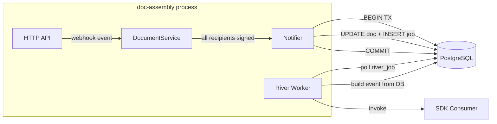
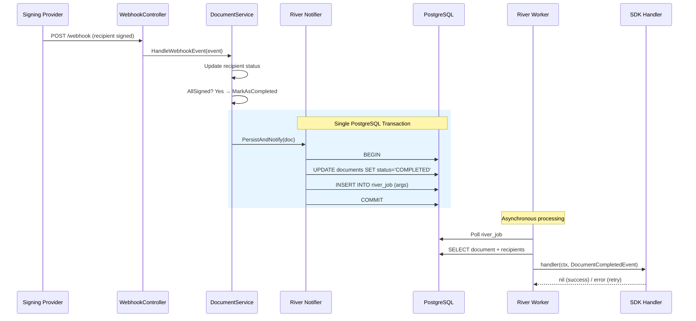
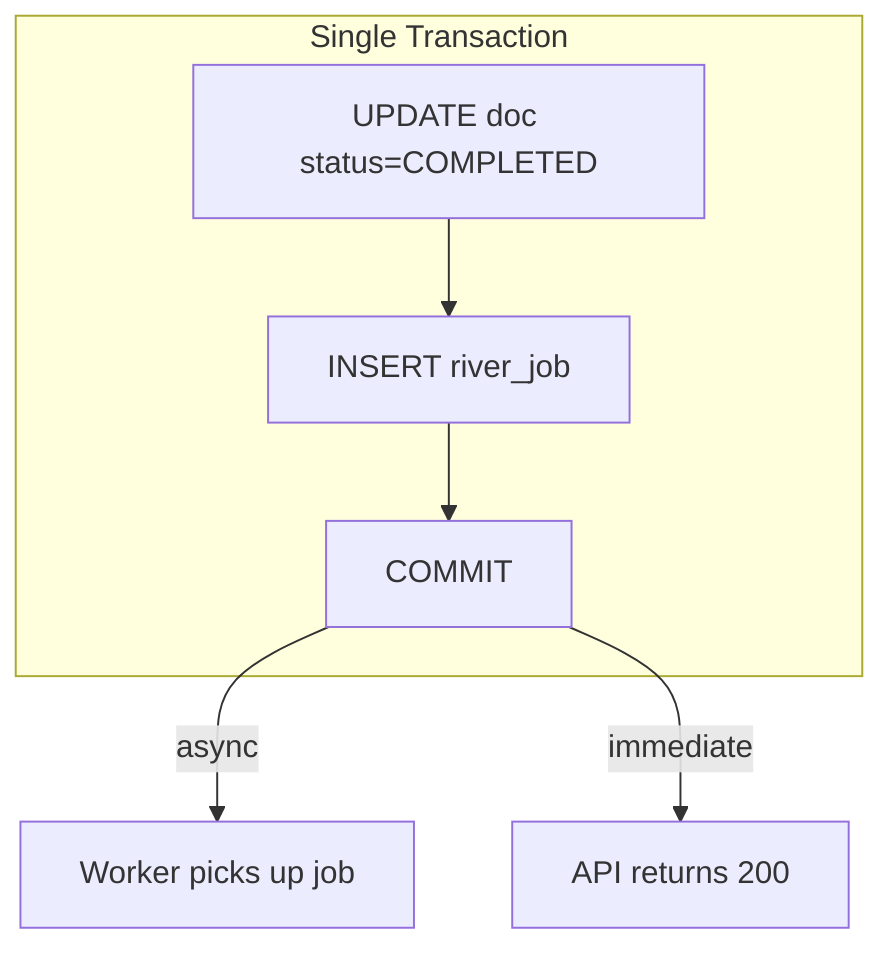
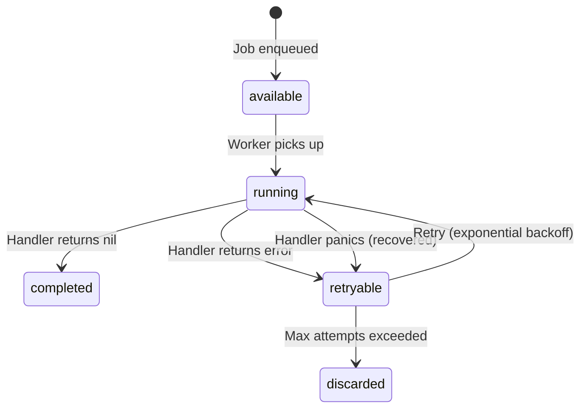

# Worker Queue Guide — River Document Completion

Background job processing for document completion events using [River](https://riverqueue.com), a PostgreSQL-native job queue for Go.

## Architecture Overview

River runs inside the same Go process as the API server, sharing the PostgreSQL connection pool. No external broker (Redis, RabbitMQ) is needed.



## Document Completion Flow

When all recipients sign a document, the system enqueues a completion job atomically with the status update.



## Transactional Atomicity

The key design decision: document status update and job enqueue happen in the **same database transaction**. This guarantees:

- No "completed document without job" (crash between UPDATE and INSERT)
- No "job without completed document" (crash between INSERT and UPDATE)
- The `river_job` table lives in the same PostgreSQL database — no 2PC needed



## Fallback Behavior

When no completion notifier is configured (`SetCompletionNotifier` not called), the document service falls back to a plain `documentRepo.Update()` — no jobs are enqueued, no handler is invoked.

```go
// internal/core/service/document/document_service.go
func (s *DocumentService) persistDocUpdate(ctx context.Context, doc *entity.Document) error {
    if doc.IsCompleted() && s.completionNotifier != nil {
        return s.completionNotifier.PersistAndNotify(ctx, doc)
    }
    return s.documentRepo.Update(ctx, doc)
}
```

## Job Deduplication

Jobs use River's built-in unique constraints to prevent duplicate processing:

| Constraint | Value | Effect |
|------------|-------|--------|
| `ByArgs` | `true` | Same `document_id` = same job |
| `ByPeriod` | `1 hour` | Dedup window resets after 1h |

This means: sending a COMPLETED webhook twice, or concurrent race conditions where two recipients complete simultaneously, will only produce **one job**.

## Error Handling & Retries



| Scenario | Behavior |
|----------|----------|
| Handler returns `nil` | Job completed, removed from queue |
| Handler returns `error` | Job marked retryable, exponential backoff |
| Handler panics | Panic recovered, treated as error, retried |
| Document deleted before processing | `buildCompletedEvent` fails, retried then discarded |
| Timeout (>30s) | Job cancelled, retried |

## Configuration

In `settings/app.yaml`:

```yaml
worker:
  enabled: false              # DOC_ENGINE_WORKER_ENABLED
  max_workers: 10             # DOC_ENGINE_WORKER_MAX_WORKERS
```

| Variable | Default | Description |
|----------|---------|-------------|
| `DOC_ENGINE_WORKER_ENABLED` | `false` | Enable River job queue workers. When `false`, jobs are inserted but never processed (insert-only mode). |
| `DOC_ENGINE_WORKER_MAX_WORKERS` | `10` | Max concurrent worker goroutines for the default queue. |

## SDK Types

The `sdk` package re-exports internal types for consumer use:

```go
import "github.com/rendis/doc-assembly/core/sdk"

// Register a handler before starting the engine.
handler := func(ctx context.Context, ev sdk.DocumentCompletedEvent) error {
    log.Printf("Document %s completed in tenant %s", ev.DocumentID, ev.TenantCode)
    for _, r := range ev.Recipients {
        log.Printf("  %s (%s) signed at %v", r.Name, r.RoleName, r.SignedAt)
    }
    return nil // return error to retry
}
```

### DocumentCompletedEvent Fields

| Field | Type | Description |
|-------|------|-------------|
| `DocumentID` | `string` | UUID of the completed document |
| `ExternalID` | `*string` | Client-provided external reference (nullable) |
| `Title` | `*string` | Document title (nullable) |
| `Status` | `DocumentStatus` | Always `COMPLETED` |
| `WorkspaceCode` | `string` | Workspace code |
| `TenantCode` | `string` | Tenant code |
| `CreatedAt` | `time.Time` | Document creation timestamp |
| `UpdatedAt` | `*time.Time` | Last update timestamp |
| `ExpiresAt` | `*time.Time` | Expiration timestamp (nullable) |
| `Recipients` | `[]CompletedRecipient` | All signers with role and status |

### CompletedRecipient Fields

| Field | Type | Description |
|-------|------|-------------|
| `RoleName` | `string` | Signer role name from template |
| `SignerOrder` | `int` | Signing order (1-based) |
| `Name` | `string` | Recipient full name |
| `Email` | `string` | Recipient email |
| `Status` | `RecipientStatus` | Always `SIGNED` for completed docs |
| `SignedAt` | `*time.Time` | Signing timestamp |

## Package Structure

```
core/internal/infra/riverqueue/
├── args.go          # DocumentCompletedArgs — job kind + dedup opts
├── client.go        # RiverService — lifecycle (New, Start, Stop, Notifier)
├── notifier.go      # Notifier — PersistAndNotify (transactional)
├── worker.go        # DocumentCompletedWorker — builds event, calls handler
└── river_integration_test.go  # 9 integration tests (see below)

core/internal/core/port/
└── document_completion.go     # Interfaces: DocumentCompletionNotifier, DocumentCompletedHandler

core/sdk/
└── worker.go                  # Re-exported types for SDK consumers
```

## Integration Tests

Located at `internal/infra/riverqueue/river_integration_test.go`. Run with:

```bash
go test -tags=integration -run TestRiver -v -count=1 ./core/internal/infra/riverqueue/
```

| Test | What it validates |
|------|-------------------|
| `TestRiver_HappyPath` | Full flow: webhook signing → River job → handler with correct event data |
| `TestRiver_TransactionalAtomicity` | Doc update + job insert in single transaction |
| `TestRiver_HandlerPanic` | Panic recovery — job retried, process survives |
| `TestRiver_HandlerError` | Error retry — job stays in queue |
| `TestRiver_UniqueDedup` | Double `PersistAndNotify` → exactly 1 job |
| `TestRiver_NilNotifier` | Fallback to `repo.Update`, zero jobs |
| `TestRiver_ConcurrentWebhooksRace` | Simultaneous recipient signing → 1 job (race-safe) |
| `TestRiver_DoubleCompletionIdempotent` | COMPLETED webhook twice → idempotent |
| `TestRiver_OrphanedJob` | Deleted document → worker error, handler never called |

## Database Tables

River manages its own tables (auto-migrated on startup):

- `river_job` — Job queue with args (JSONB), state, attempt count
- `river_migration` — Schema version tracking

These live in the `public` schema alongside application tables. No manual migration needed.
