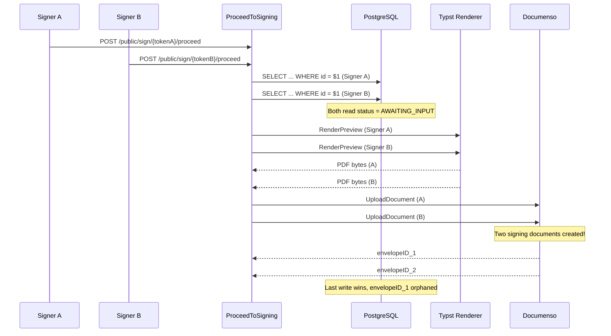
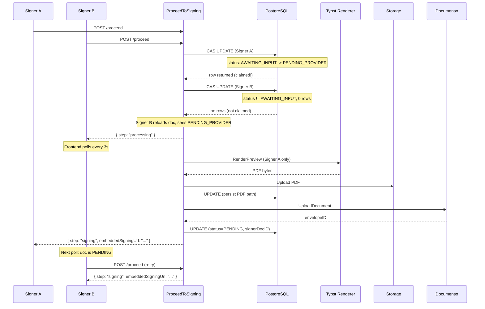
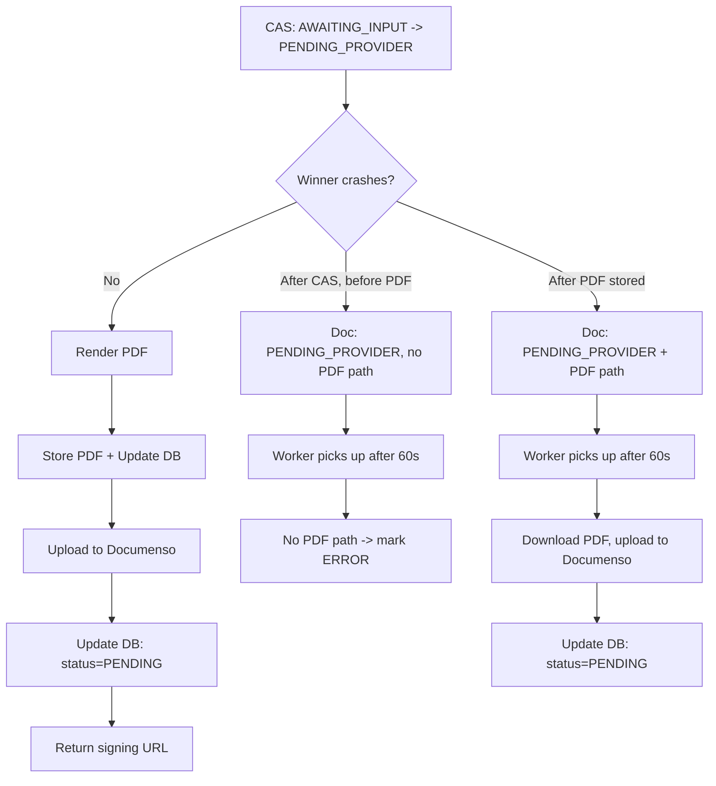

# ProceedToSigning Concurrency Control

## Problem

When two signers call `ProceedToSigning` simultaneously on the same `AWAITING_INPUT` document, both could read the status, both render the PDF, and both upload to the signing provider — creating **duplicate documents in Documenso**.

Additionally, the background worker `ProcessPendingProviderDocuments` queries `PENDING_PROVIDER` documents and could race with the inline upload.

### Race Condition (Before Fix)



## Solution: CAS Claim + Worker Grace Period

### 1. CAS (Compare-And-Swap) Claim

An atomic `UPDATE ... WHERE status = 'AWAITING_INPUT'` ensures only one caller transitions the document to `PENDING_PROVIDER`. PostgreSQL's row-level locking guarantees mutual exclusion.

```sql
UPDATE execution.documents
SET status = 'PENDING_PROVIDER', updated_at = NOW()
WHERE id = $1 AND status = 'AWAITING_INPUT'
RETURNING ...
```

- **Winner** (rows affected = 1): Proceeds with render + upload.
- **Loser** (rows affected = 0): Receives `step: "processing"` response; frontend polls until ready.

### 2. Worker Grace Period

The background worker `ProcessPendingProviderDocuments` skips documents updated in the last 60 seconds:

```sql
WHERE status = 'PENDING_PROVIDER'
  AND updated_at < NOW() - INTERVAL '60 seconds'
```

This prevents the worker from racing with the winner's inline upload. If the winner crashes, the worker picks up the document after 60 seconds.

### Corrected Flow



### Crash Recovery



## Implementation

### Files Modified

| File | Change |
|---|---|
| `core/.../document_repo/queries.go` | `queryClaimForSigning` CAS query; 60s grace period on `queryFindPendingProviderForUpload` |
| `core/.../port/document_repository.go` | `ClaimForSigning(ctx, id) (*Document, bool, error)` |
| `core/.../document_repo/repo.go` | `ClaimForSigning` implementation using `scanDocument` + `pgx.ErrNoRows` |
| `core/.../usecase/document/pre_signing_usecase.go` | `StepProcessing = "processing"` |
| `core/.../service/document/pre_signing_service.go` | `claimAndRender` helper, `buildProcessingResponse`, `GetPublicSigningPage` PENDING_PROVIDER handling |
| `app/.../public-signing/types.ts` | `'processing'` added to step union |
| `app/.../public-signing/components/PublicSigningPage.tsx` | Retry loop in `handleProceed` + page load polling |

### Status Machine

```
AWAITING_INPUT ──CAS──> PENDING_PROVIDER ──upload──> PENDING ──> IN_PROGRESS ──> COMPLETED
                              │                                                    │
                              └──crash/fail──> ERROR                    DECLINED ──┘
                                                                        VOIDED
                                                                        EXPIRED
```

### Known Limitations

- If the winner crashes after the Documenso upload but before the final DB update, the background worker may upload again (duplicate in provider). This requires Documenso-side idempotency to fully solve.
- ERROR documents without `SignerDocumentID` cannot be retried by the retry worker.
